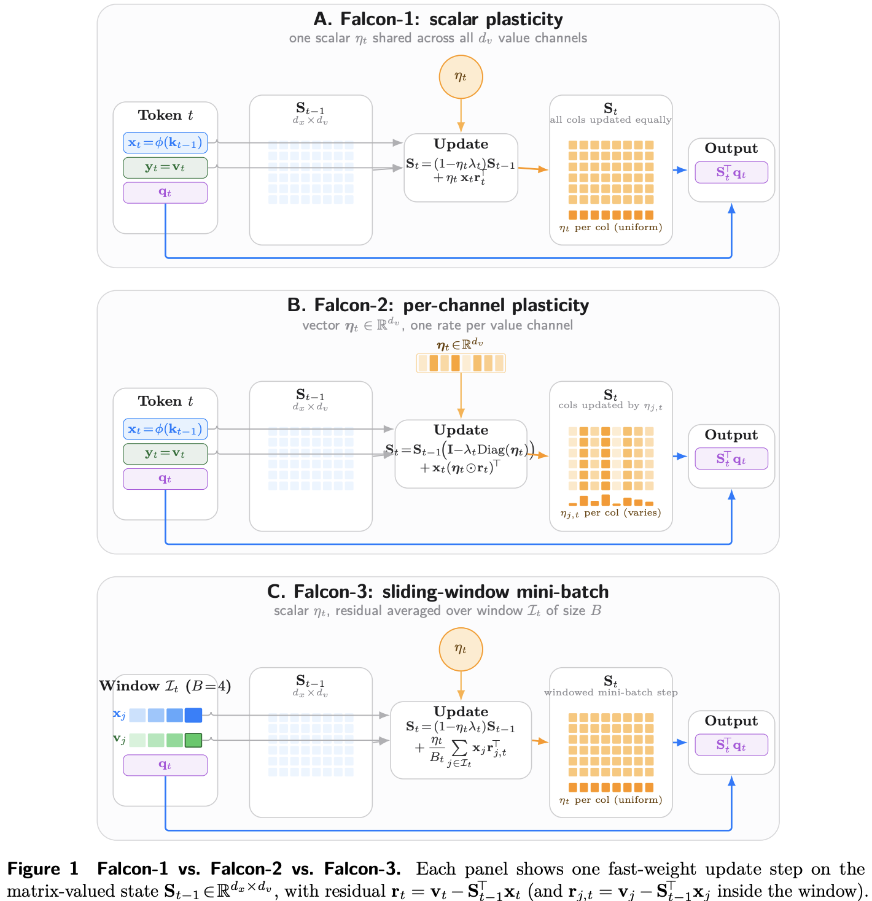

# Fast Weight Attention

[](https://yifanzhang-pro.github.io/fast-weight-attention/fast-weight-attention.pdf) 
[](https://yifanzhang-pro.github.io/fast-weight-attention) 
[](https://opensource.org/licenses/Apache-2.0) 
[](https://www.python.org/downloads/) 

### Falcon: Fast Weight Attention for Continual Learning

Recurrent fast-weight memories and selective state-space models compress a growing context into a bounded state, their writes can therefore be viewed as online continual-learning rules.

**Date:** March 9, 2026

[[Project Page](https://github.com/yifanzhang-pro/fast-weight-attention)] [[Webpage](https://yifanzhang-pro.github.io/fast-weight-attention)] 




## Citation

```bibtex
@article{zhang2026fast,
  title = {Fast Weight Attention for Continual Learning},
  author = {FWA Authors},
  journal = {yifanzhang-pro.github.io},
  year = {2026},
  month = {March},
  url = "https://github.com/yifanzhang-pro/fast-weight-attention"
}
```
